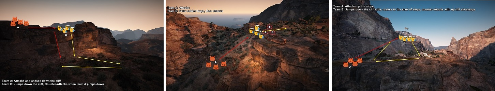
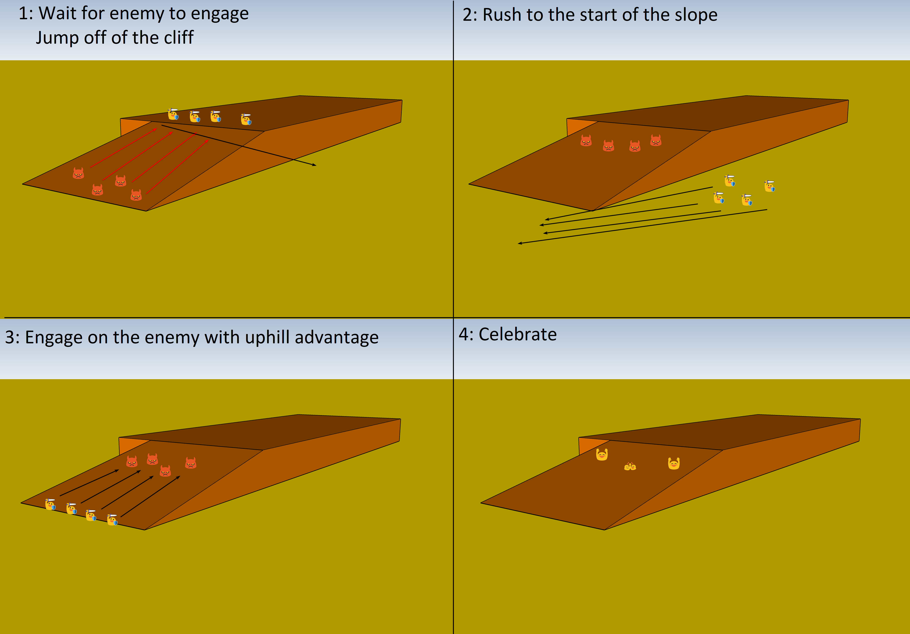

# Wednesday 04/07/2018

# Summary

1. Repeated dropping of a cliff
2. Repeated attacking on a slope
3. Practiced the combination of both

 

# Topic Details

## 1. Repeated dropping of a cliff

See training of [Wednesday 27/06/2018](../../2018-06-27/Docs/Intro.md)

## 2. Practiced skills that can be used to attack enemies on higher ground

See training of [Wednesday 27/06/2018](../../2018-06-27/Docs/Intro.md)

## 3. Practiced the combination of both

The third exercise was a combination of both, this can be useful in some scenarios:

- When you are being pushed with enemy PA's, you waste their PA's by running away
- When the enemy is not very coordinated, you will be able to pick off the "snakes" at the beginning of the slope 
- Pushing up a slope is generally easier than pushing down one, so you switch around the advantage
- Can be used to lure people out of nodewar zone and force them to respawn node instead of fort

