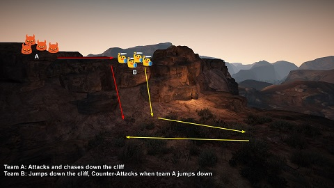
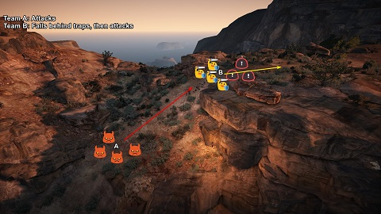
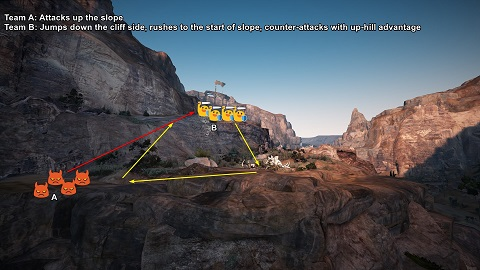

# Wednesday 27/06/2018

# Summary

1. Repeated dropping of a cliff
2. Repeated attacking on a slope
3. Practiced the combination of both

| 1. Cliff Drop | 2. Slope | 3. Cliff and Slope |
| --- | --- | --- |
|  |  |  |

# Topic Details

## 1. Practiced how to safely drop down a cliff

In open world, it is important that you use the games' terrain to your advantage. One specific type of terrain that can either save your life or win a whole engage, are cliffs. 
By dropping down a cliff as an enemy engages on you, you force your enemy to pick a fight they have a disadvantage at, or to leave you be and fight another time.

In order to execute this properly, every class needs to know how they can jump down a cliff fast and safely.

| Witch | Wizard | Valkyrie | Sorceress | Musa | Warrior | Zerker | Kunoichi | 
| --- | --- | --- | --- | --- | --- | --- | --- |
| No safe ways found. | No safe ways found. | **Awakening:** [hold A/D + Q] + [tap LMB/RMB] | Any i-frame ability | Crosscut | PvE Roll | No input | No input | 
| | | **Pre-Awakening:** [hold A/D + Q] + [tap RMB] | Midnight Stinger before landing | Below the Belt | | | |
| | | | | One Step Back | | | |
| | | | | Dragon Bite (if timed well) | | | | |

| Ninja | Lahn | Ranger | Tamer | Mystic | Dark Knight | Maehwa | Striker |
| --- | --- | --- | --- | --- | --- | --- | --- |
| No input | No input | No input | No input | No input | No input | No input | No input |

## 2. Practiced skills that can be used to attack enemies on higher ground

| Witch | Wizard | Valkyrie | Sorceress | Musa | Warrior | Zerker | Kunoichi | 
| --- | --- | --- | --- | --- | --- | --- | --- |
| Fireball | Fireball | Celestial Spear | Signs of Agony | Arrows | Spear | No input | No input |
| Fireball Explosion | Fireball Explosion | Celestial Smite | Dream of Doom | | | | |
| Meteor | Meteor | Sanctitas de Enslar | | | | | | 
| Chain Lightning | | | | | | | | |

| Ninja | Lahn | Ranger | Tamer | Mystic | Dark Knight | Maehwa | Striker |
| --- | --- | --- | --- | --- | --- | --- | --- |
| No input | No input | No input | No input | No input | No input | No input | No input |

## 3. Practiced skills that can be used to attack enemies on lower ground

| Witch | Wizard | Valkyrie | Sorceress | Musa | Warrior | Zerker | Kunoichi | 
| --- | --- | --- | --- | --- | --- | --- | --- |
| Fireball | Fireball | Celestial Spear | Signs of Agony | Arrows | Spear | No input | No input |
| Fireball Explosion | Fireball Explosion | Celestial Smite | Dream of Doom | | | | |
| Meteor | Meteor | Sanctitas de Enslar | | | | | | 
| Chain Lightning | Blizzard | Wave of Light (if there's a target) | | | | | |
| Blizzard | | | | | | | |
| Detonative Flow | | | | | | | |
| Residual Lightning | | | | | | | | |

| Ninja | Lahn | Ranger | Tamer | Mystic | Dark Knight | Maehwa | Striker |
| --- | --- | --- | --- | --- | --- | --- | --- |
| No input | No input | No input | No input | No input | No input | No input | No input |

## 4. Practiced baiting by rubberbanding skills

Witchards specifically, can bait enemies into think they dropped down a cliff, by using their TP skill. The TP skill will make it seem as if you tried to get behind your enemy, but you end up being rubberbanded back to your starting position, due to the game not liking it very much that you move distances through the air. 

## 5. Practiced positioning on slopes

The second exercise in using terrain to our advantage was by using a slope. Most classes in BDO, do not have an advantage when they are on the higher part of a slope. This makes pushing up hill more favourable than pushing down hill. One way to bait an enemy into engaging on you, is by picking a position on a slope which converts into a flat-ish area at the top, placing tons of stun traps there and lure your enemy into them.

In order to fully take advantage of this tactic as the people on top of the slope, you can:

- Continuously throw damage, even if it doesn't hit, it does scare off the enemy.
- Have witchards stand a bit to the side, instead of directly behind the front line, blizzard is still useful if the terrain allows it

To counter this tactic, as the people pushing up the slope, you can:

- Ensure your frontline pushes through deep enough
- Your witchards TP through and go straight to the backline (switching positions basically)
- Engage fast enough, so the enemy does not have the ability to reach behind their own stun traps in time

## 6. Reminded everyone to stay active during idle time by using skills or placing traps

It is extremely important that you don't just stand still when there is some idle/waiting time during a nodewar or fight. There is always something to do:

- Place stun traps
- Cast AOE skills, to avoid ninjas/kunos engaging on us from stealth
- Heal team mates
- Being aware of the map and predicting where enemies will come from

## 7. Additional Tips & Feedback

- As a witch it's usually not a good idea to get too close to the enemy, but calculated risks are very appreciated. In the scenario where enemies are dropping down a cliff, a witch can take advantage of that by putting pressure with the following skills:
  * Voiltaic Pulse
  * Thunder Storm
- Valkyries and Mystics can put the same pressure by using their vacuums

